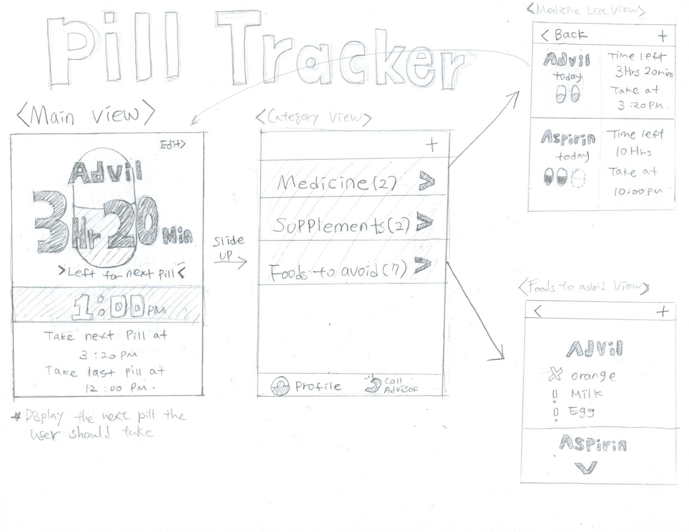
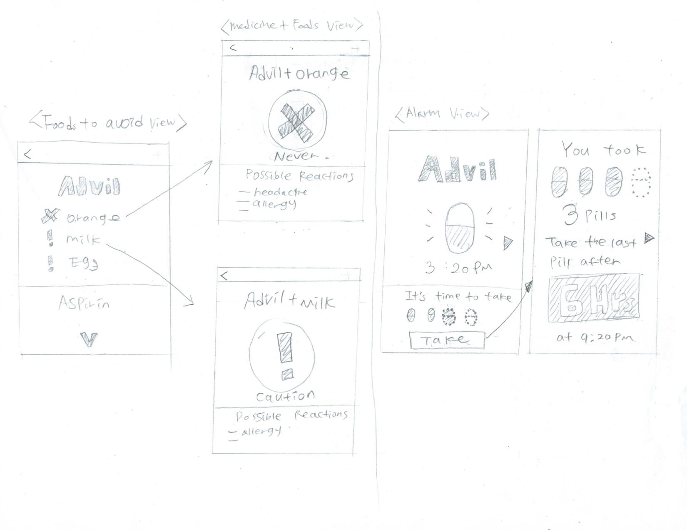
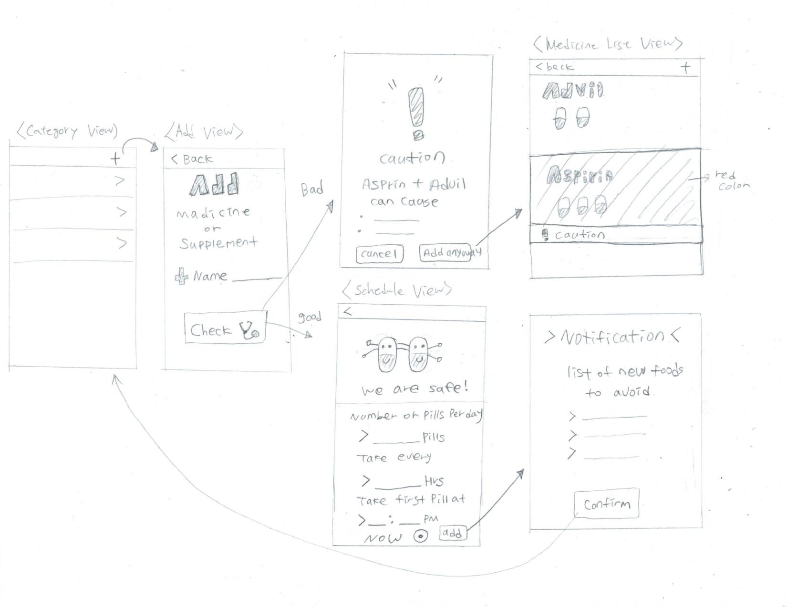

# Pill Tracker

## Author: Kangsik Kevin Lee

## Purpose:
Athletes that take medications or supplements. What makes athletes distinct from\n
other people that take pills is their more stringent diet, as well as how
instrumental taking their pills can be to their performance. For medications, 
the need is pretty uniform no matter who is taking them. But supplements, which 
usually have less drastic effects, can be essential to an athlete’s performance, 
and because of this affect how well they can do their job and get paid. 
In addition, because an athlete may already have dietary restrictions different 
than the general public, this app’s ability to warn the user of what not to eat 
is a necessity. Athletes may also want to factor in how side effects of the 
pills may affect their performance to weigh the benefits of taking a pill now or
later,something we can further look into.

## Features:
- There are two major features of this application. First, it helps people can 
track of time they took the last pill, and it reminds them to take the next pill
on time. For those who take daily medicine, it is very crucial to remember to 
take their pills on time. Depending on a patient’s condition, missing a pill on 
time can lead to a fatal situation. Also, it is very easy to lose track of the 
time they took the last pill. Not only can patients benefit from this 
application, but also people who take daily supplements such as vitamins and 
pro-biotics.
- The second major feature is providing information about foods or other 
medicines to avoid. There are tons of pills, but not much widespread information 
about them. Some medicines can possibly react badly with some particular food. 
Users can avoid the foods by checking the list, and they can avoid other drugs 
if the application alerts users for possible reactions. It allows users to 
set up for specific condition of users too such as pregnancy.

## Control Flow: Low-fidelity

## Implementation

### Model
 - PillManager.swift
 - Medicine.swift
 - Supplement.swift
 - Food.swift
  
 
### View
 - MainView
 - CategoryView
 - AddMedicineView
 - MedicineListView
 - FoodsToAvoidView
 - MedicineAndFoodDetailView
 - ScheduleView

### Controller
 - MainViewController
 - CategoryViewController
 - AddMedicineViewController
 - MedicineListViewController
 - FoodsToAvoidViewController
 - MedicineAndFoodDetailViewController
 - ScheduleViewController
